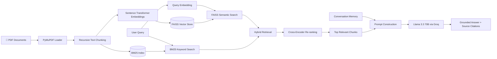
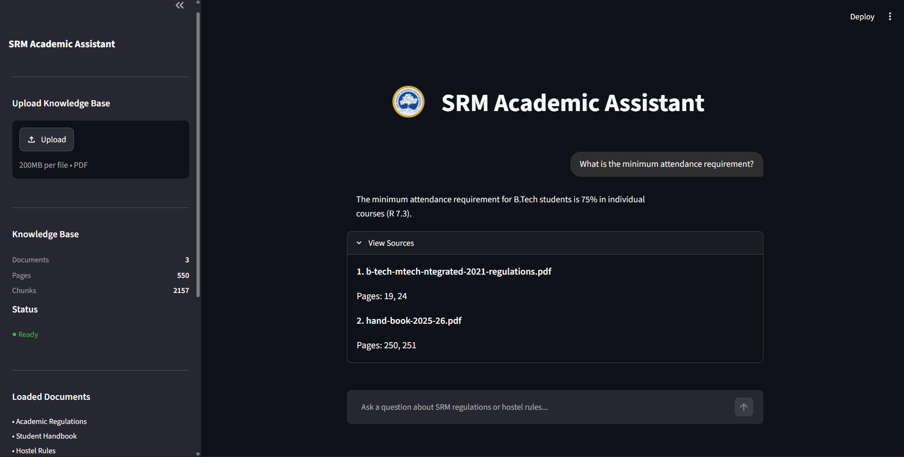

# 🎓 SRM Academic RAG Assistant

> A Hybrid Retrieval-Augmented Generation (RAG) system that enables students to interact with official SRM Institute documents using natural language. The assistant retrieves relevant information from uploaded PDFs, re-ranks results using a Cross-Encoder, and generates grounded responses with document and page citations.

<p align="center">


</p>

---

## 📖 Overview

Searching through university regulations, student handbooks, and hostel policies can be time-consuming and inefficient. Students often need to navigate hundreds of pages to locate a single rule, deadline, or policy.

**SRM Academic RAG Assistant** addresses this problem by enabling users to ask questions in natural language while retrieving information directly from official university documents. Instead of relying on general-purpose language model knowledge, the assistant searches the uploaded knowledge base, retrieves the most relevant passages, re-ranks them for improved relevance, and generates responses grounded in the retrieved context.

Every response is accompanied by the corresponding source document and page reference, allowing users to verify the information directly from the original document.

---

## ✨ Key Features

- 📄 Multi-document PDF knowledge base
- 🔍 Hybrid (FAISS semantic + BM25 keyword-based) Retrieval 
- 🎯 Cross-Encoder re-ranking for improved retrieval quality
- 💬 Conversational memory for follow-up questions
- 📚 Automatic source citation with document and page references
- 📤 PDF upload with automatic knowledge base rebuilding
- ⚡ Fast inference using Groq and Llama 3.3 70B
- 🖥️ Interactive Streamlit web interface
- 📊 Custom evaluation framework for measuring RAG performance

---

# 🚀 System Architecture

---
# 📊 Evaluation

The system was evaluated using a manually curated benchmark consisting of **74 academic and hostel-related questions**.

| Metric | Score |
|---------|------:|
| Pass Rate | **89.19%** |
| Correctness | **0.852** |
| Faithfulness | **0.984** |
| Context Recall | **0.956** |
| Context Precision | **0.929** |
| Hallucination Rate | **0.049** |
| Composite Score | **0.930** |

### Evaluation Highlights

- Multi-document benchmark
- Ground-truth answer comparison
- Retrieval quality assessment
- Hallucination measurement
- Automated evaluation pipeline

---


# 🛠️ Technology Stack

| Category | Technologies |
|-----------|--------------|
| Programming Language | Python |
| Frontend | Streamlit |
| LLM | Llama 3.3 70B (Groq) |
| AI Framework | LangChain |
| Embedding Model | sentence-transformers/all-MiniLM-L6-v2 |
| Vector Database | FAISS |
| Retrieval | Hybrid Retrieval (FAISS + BM25) |
| Re-ranking Model | Cross-Encoder (ms-marco-MiniLM-L-6-v2) |
| PDF Processing | PyMuPDF |
| Conversation | LangChain Conversation Memory |

---

# 📂 Project Structure

```text
srm-academic-rag-assistant
│
├── data/                             # Knowledge base PDFs
│   ├── b-tech-mtech-integrated-2021-regulations.pdf
│   ├── hand-book-2025-26.pdf
│   └── srm-hostel-rules-2025.pdf
│
├── experiments/                      # Benchmarking & evaluation
│
├── faiss_index/                      # Generated FAISS vector database
│
├── src/
│   ├── assets/
│   │   └── SRMIST_logo.png
│   ├── app.py                        # Streamlit application
│   ├── chatbot.py                    # Chat interface
│   ├── rag.py                        # Main RAG pipeline
│   └── build_index.py                # Knowledge base indexing
│
├── .env                              # Environment variables
├── .gitignore
├── README.md
└── requirements.txt
```
---

# 📸 Demo
### Main Interface

The SRM Academic RAG Assistant provides a clean conversational interface for interacting with official university documents. Users can upload PDFs, build the knowledge base, ask natural language questions, and view the exact source documents and page numbers used to generate each response.

<p align="center">
  
</p>

---

# 🚀 Installation

## Prerequisites

Before running the project, ensure the following are installed:

- Python **3.14.3** (tested)
- Git
- A Groq API Key

---

### 1. Clone the Repository

```bash
git clone https://github.com/gr-hemanth/srm-academic-rag-assistant.git

cd srm-academic-rag-assistant
```

### 2. Create a Virtual Environment

```bash
python -m venv .venv
```

Activate the environment
**Windows (PowerShell)**

```powershell
.\.venv\Scripts\Activate.ps1
```

**Windows (Command Prompt)**

```cmd
.venv\Scripts\activate.bat
```

**Linux / macOS**

```bash
source .venv/bin/activate
```
---

### 3. Install Dependencies

```bash
pip install -r requirements.txt
```

---

### 4. Configure Environment Variables

Create a `.env` file in the project root.

```env
GROQ_API_KEY=your_groq_api_key
```

---

### 5. Run the Application

```bash
streamlit run src/app.py
```

The application will be available at

```
http://localhost:8501
```

---

# 💡 Usage

### Building the Knowledge Base

1. Launch the application.
2. Upload one or more PDF documents.
3. Click **Build Index**.
4. Wait for indexing to complete.
5. Start asking questions.

---

# 🔮 Future Roadmap
Version 2.0

- Docling integration for advanced document parsing
- Metadata-aware retrieval
- Improved retrieval strategies
- Docker support
- Cloud deployment
- Extended benchmark suite
---

# 👨‍💻 Author

**G R Hemanth**

Computer Science Engineering Student

If you found this project helpful, consider giving it a ⭐ on GitHub.

---
## 🤝 Contributing

Contributions, ideas, and feedback are always welcome.

Feel free to **fork** this repository, open an issue, or submit a pull request if you'd like to improve the project.

Whether it's fixing a bug, improving the documentation, or adding a new feature, every contribution is appreciated.

---
